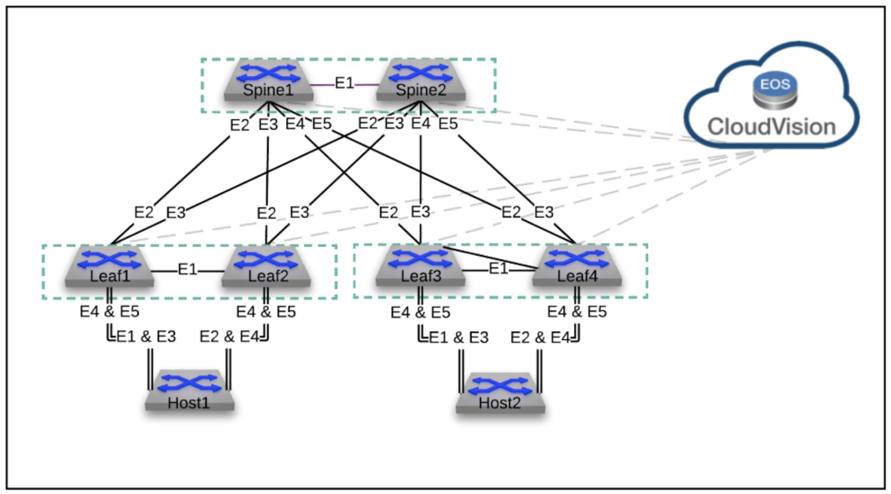

# VXLAN-EVPN repo

- rep. TRAINING : used for user who wants to ramp up on EVPN-VXLAN technology
- Content :
  - Arista virtual EOS
  - Topology
    - 4x leaf switches
    - 2x spines swiches
    - 2x hosts
    - 1x CVP instance

  
  
  - Use cases for this version
    - eBGP based for both underlay and overlay
    - VXLAN data plane
    - Pure L2VPN
    - L2VPN with Asymetric IRB
    - L2VPN with Symetric IRB
    - L3VPN (Option-A)
  - Out of scope of this version
    - EVPN A-A
    - EVPN Multicast

If customer want to skip sections and jump to a particular part of the testing, they can copy paste configurations from the Initial configs section of each day lab.

**Lab conventions:**

- Contain services, addressing scheme and conventions
- Located [here](lab-conventions.md)

*Expectations notes:*

- It is expected that the L3LS EVPN fabric will be up and running in all labs, it’s mandatory!
- In each Scenario you are expected to test the use case which is asked, you don’t have to double check if everything else you configure before to work!
- Each scenario will teach you a piece of the puzzle so focus on that firstly!
- It is not mandatory to go through each and every lab in order, we just need to complete the L3LS EVPN fabric (manually or via preconfig) A1 section, then we can jump to any lab.
- In the section of L3VPN make sure you are able to bring sessions up, and have reachability, this is important. 

**Comment** : **Big up to @onurgashi !!!** 
