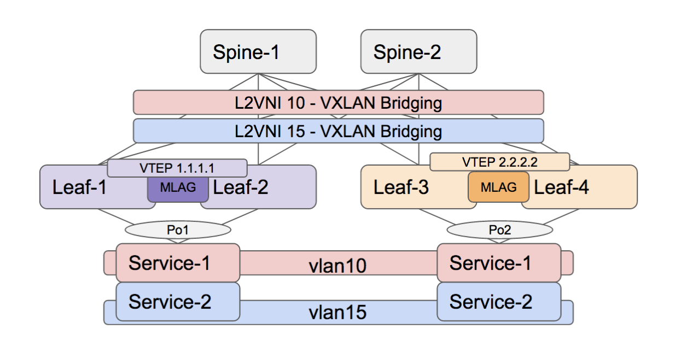

# Lab Guide - Day-1 - EVPN Infrastructure

## Lab topology


## Notes about this lab

* This is not a “push-command” lab (except for IP addresses config. Or some basic stuff)
  * Try the commands
  * It could have some basic missing and traps
  * The goal is not to finish absolutely but more for understanding
  * Lab will be available
* **If it is a new training session (different from day-1 and day-2) : Save on each box the initial-configurations for later-purposes**
  * `copy running-configuration flash:init_conf_ADC.eos`
* **If it is the same training session from day-1 and day-2 : Restore the initial configuration on Spine1, Spine2, Leaf1, Leaf2, Leaf3, Leaf4**
  * `Configuration replace flash:init_conf_ADC.eos`
* Don’t forget to save your running-configuration frequently.
  * `copy running-configuration startup-configuration`
  * or `wr`
* If you don’t finish the lab : 
  * don’t worry about it 
  * You’ll have the lab to practice later on

## ADC initial configurations

* Use this if you are going to start from day-1 only
* Copy to each devices the configurations localized in day-1/solutions

## L2VPN configuration

1. Overview



2. Configure VLAN and trunks
   1. Use diagram to understand what VLANs need to be created
   2. Verify MAC learning and ports
3. Configure MAC-VRF
   1. VLAN based
      1. RD should be RID:VNI
      2. RT should be VTEP:VLAN
   2. Verify Type-3 exchange
   3. Verify BGP for Type-2 routes
   4. Verify VXLAN and MAC tables

* Test reachability from Host1 to Host2 and vice versa
* Test failover by disabling uplink of a leaf pair to Spine
* Make sure there is no packet loss

## Usefull examples (try to not cut-and-paste)

* vlan configuration

```
vlan 10
```

* L2 VNI configuration

```
interface vxlan 1
  vxlan vlan 10 vni 10
```

* MAC VRF configuration (vlan aware)

```
router bgp 65001
  vlan 10
    rd 123.1.1.3:10
    route-target both 10:10
    redistribute learned
```