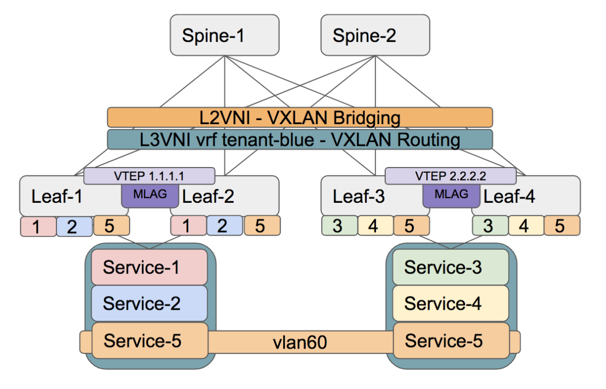

## Topology  

   

VLAN40 (S1) VLAN45 (S2) are only on VTEP 1.1.1.1  
VLAN50 (S3) VLAN55 (S4) are only on VTEP 2.2.2.2  
VLAN60 (S5) is stretched across all VTEPs with VNI to VLAN mapping  

## Instructions 

Replace the current devices configuration with the configuration files located in the directory [EVPN_VXLAN_troubleshooting](/TRAINING/day-2/initial_conf/EVPN_VXLAN_troubleshooting)

Note: The configuration files are not correct

## Run the following tests

#### L2 ping

```
host2#ping vrf vlan60 10.0.60.1 source 10.0.60.2
```
It doesnt work 

#### L3 ping

```
host2#ping vrf vlan50 ip 10.0.40.1 source 10.0.50.2
```

It doesnt work 

#### Spot the root causes and fix the issues 

Refer to the network diagramm and use the various show commands we discussed to spot and fix all issues 

Try to not use the [solution](/TRAINING/day-2/solutions/Troubleshooting_lab)